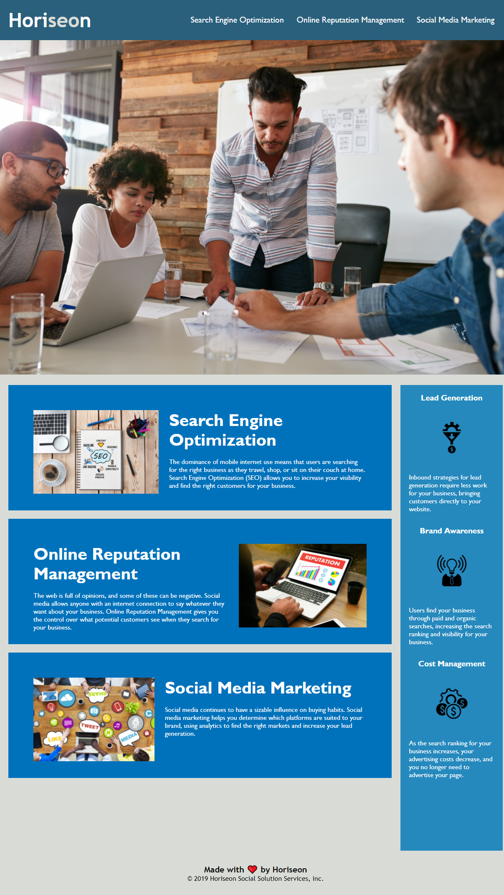

# HTML CSS Git Challenge: Code Refactor

Challenge 1 refactoring code to help develop working knowledge of HTML, CSS, and GitHub
I was tasked with organizing symantic HTML and condensing CSS to make for a more concise coding experience for future teams working on the Horiseon website.

Accessibility attributes were added to enhance SEO and ensure accessibility standards are met.

I applied lessons on clean code and was able to remove several duplicate code entries in the css by applying proper ID and Class elements to HTML and linking correctly through CSS.

Refactoring details

- when source code is viewed you now find logical symantic HTML structure
- when image elements are viewed accessible alt attributes are now present for all images
- when heading elements are viewed they fall in sequential order
- added concise title element

[Site Link] (https://woodb58.github.io/horiseon-challenge-uw/)

